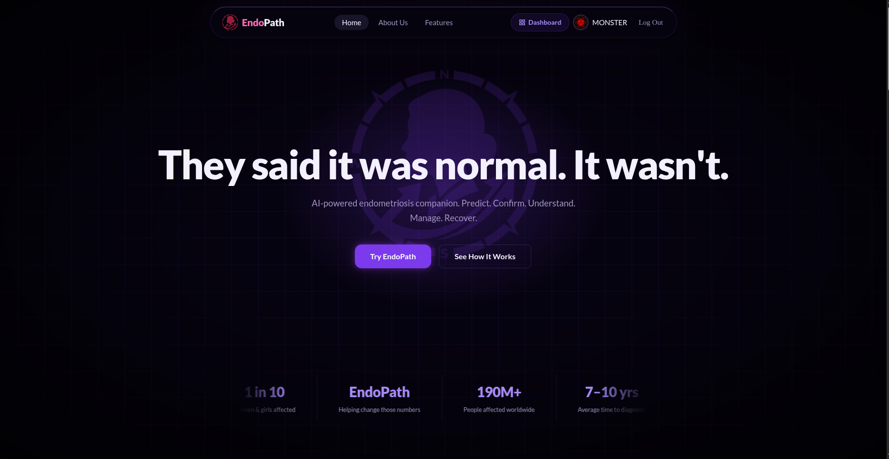
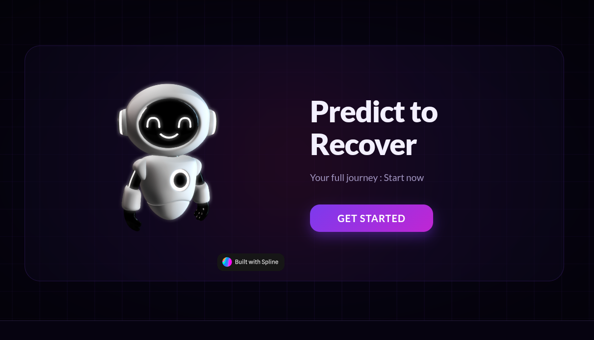
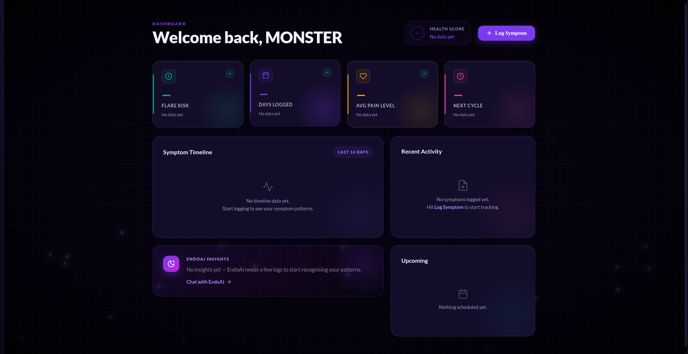
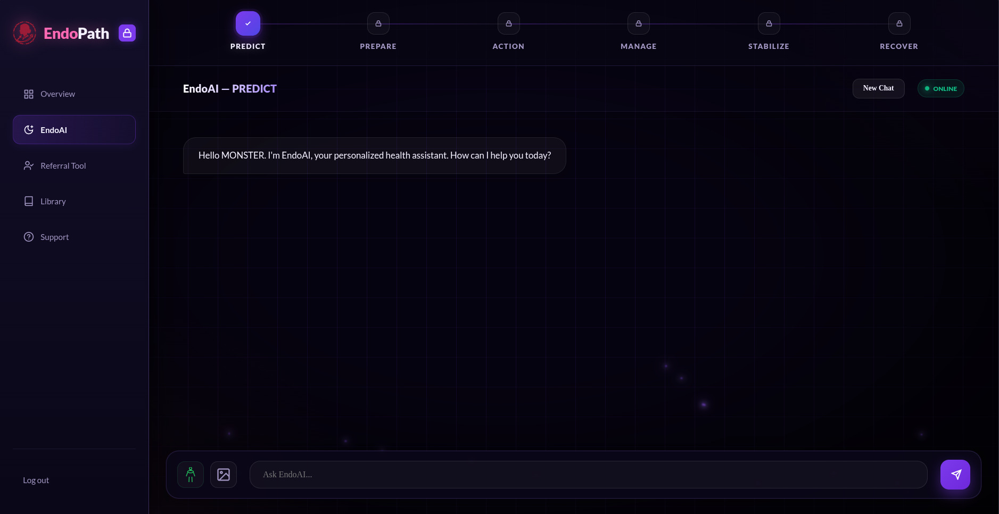
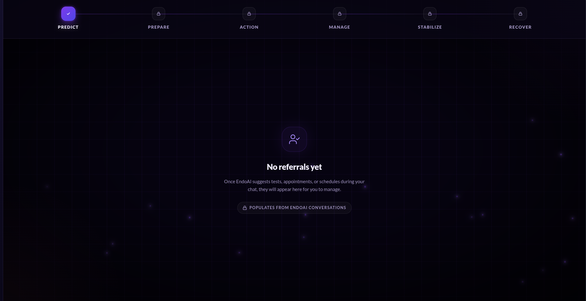
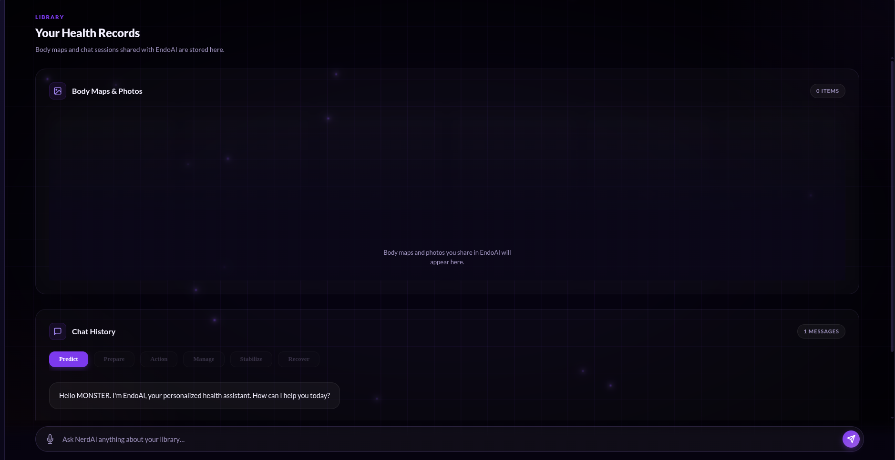
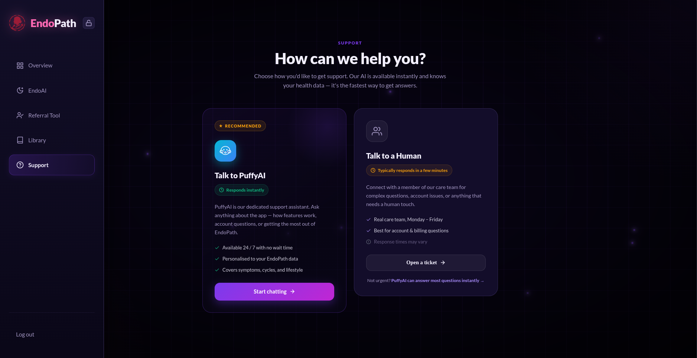
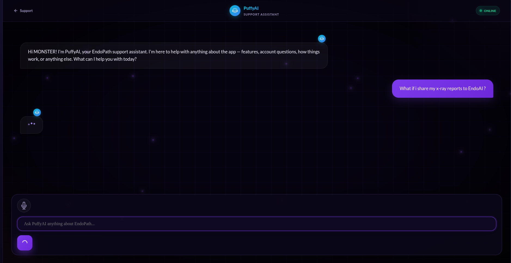

<p align="center">
  
  <br />
  <strong>EndoPath</strong>
</p>

```text
Built with:

Frontend  : React 19, Vite, React Router
Backend   : Django, Django CORS Headers, Gunicorn, WhiteNoise
AI        : Featherless AI, OpenAI-compatible API client
Auth      : Google OAuth, JWT
Exports   : jsPDF, jsPDF AutoTable
3D/Visuals: Spline, CSS modules, animated particles
Deploy    : Vercel frontend, Render-ready Django backend
```

## Demo Video

https://youtu.be/1CHN4Owsac8?si=mIqY5dZFKlR6aJ8L

## Live App

https://endo-path-jp7h.vercel.app

# EndoPath

---

EndoPath is an AI-powered endometriosis companion built to help users predict, confirm, understand, manage, and recover through a guided care journey. It combines symptom logging, staged AI conversations, body-area tracking, referral recommendations, health records, and support chat in one app.

> EndoPath is not a medical diagnosis tool. It is designed to support tracking, education, preparation, and communication with healthcare professionals.

## Landing Page



The landing screen introduces EndoPath with the line "They said it was normal. It wasn't." It sets the purpose of the app clearly: an AI-powered endometriosis companion for prediction, confirmation, understanding, management, and recovery.

## Predict to Recover CTA



This section pushes the user into the core journey. The 3D Spline assistant and "Predict to Recover" call-to-action show that EndoPath is not only a tracker, but a guided workflow from early symptoms to recovery planning.

## Health Dashboard



The dashboard summarizes the user's health state in one place. It tracks flare risk, logged days, average pain level, next cycle timing, symptom timeline, recent activity, upcoming events, and EndoAI insights.

## EndoAI Staged Assistant



EndoAI is the main health assistant. It uses a staged protocol with locked and unlocked steps, keeps each stage's conversation history, accepts text, body-area selections, and uploaded images, and extracts useful health data while chatting.

## Referral Tool



The referral tool collects medical next steps suggested by EndoAI. Tests, appointments, and schedules are grouped by stage and labelled by urgency so the user can prepare better for clinical conversations.

## Health Records Library



The library stores the user's EndoAI history, body maps, uploaded photos, symptom logs, key insights, and recommendations. It also includes NerdAI, which searches and explains information from the user's saved health records.

## Support



The support screen gives users two ways to get help: instant AI support through PuffyAI or human support for account, billing, and care-team questions. PuffyAI is recommended because it responds immediately and understands the user's EndoPath context.

## PuffyAI



This screen shows PuffyAI, the app support assistant. PuffyAI is available 24 / 7 for questions about EndoPath features, account flow, how to use the app, and what each tool does.

## Core Features

- **EndoAI staged journey**: guides users through Predict, Prepare, Action, Manage, Stabilize, and Recover stages.
- **Symptom logging**: captures symptoms, pain intensity, selected body areas, and uploaded images from chat.
- **Dashboard insights**: shows flare risk, days logged, average pain level, next cycle, symptom timeline, recent activity, and health score.
- **Referral tool**: collects AI-generated tests, appointments, and schedules with urgency labels.
- **Health records library**: stores chat history, body maps, photos, key insights, referrals, and symptom records.
- **PDF reports**: exports a doctor-ready health report from logged symptoms, insights, and recommendations.
- **NerdAI library assistant**: answers questions using the user's stored EndoAI chat history.
- **PuffyAI support**: app support assistant for feature help, account questions, and workflow guidance.
- **Google login**: signs users in with Google OAuth and stores the app session locally.

## EndoAI Protocol

EndoAI uses a 6-stage protocol:

```text
1. Predict   : asks pinpointing symptom questions and estimates probability or flare risk.
2. Prepare   : collects context, reports, body-map areas, age, risk, time, and cost concerns.
3. Action    : guides immediate relief steps and treatment preparation.
4. Manage    : supports long-term diet, supplements, medication routines, and daily patterns.
5. Stabilize : checks mental health, consistency, activity level, and ongoing improvements.
6. Recover   : reflects on recovery progress and helps the user return to normal activity.
```

The app starts with only Predict unlocked. As EndoAI sees enough context, it returns transition markers such as `[MOVE_TO_PREPARE]`, `[MOVE_TO_ACTION]`, `[MOVE_TO_MANAGE]`, `[MOVE_TO_STABILIZE]`, and `[MOVE_TO_RECOVER]`. The frontend reads these markers, confirms the move with the user, unlocks the next stage, and keeps previous stage memory available in the Library.

EndoAI also extracts structured markers from natural conversation:

```text
[PROBABILITY: 75%]
[KEY_INSIGHT: Lower right pelvic pain]
[SYMPTOM_LOG: Pelvic Pain | 7]
[REFERRAL: TEST | Pelvic Ultrasound | High]
```

These markers power the dashboard, health score, recent activity, key insights, referral tool, and exportable health report.

## Text and Image Model Switching

EndoAI can work with normal text chats and image-supported chats. The backend checks whether any chat message includes an uploaded image:

```text
No image uploaded  -> use default text model
Image uploaded     -> use preferred vision model
Vision unavailable -> fall back to text model and ask for a description
```

The default text model is used for normal symptom conversations. When the user uploads a report, scan, or symptom-related image, the backend switches to a vision-capable model from the configured vision model list. If that vision call fails or the selected model is not available, the backend falls back to the default text model so the chat does not stop.

## App Flow

```text
Home
  -> Sign in with Google
  -> Dashboard
  -> EndoAI
       Predict -> Prepare -> Action -> Manage -> Stabilize -> Recover
  -> Referral Tool
  -> Library
       Body Maps + Photos
       Chat History
       NerdAI search
       PDF export
  -> Support
       PuffyAI or human support placeholder
```

## Tech Stack

### Frontend

- React
- Vite
- React Router
- CSS Modules
- Spline 3D scene
- jsPDF and jsPDF AutoTable
- Google OAuth client

### Backend

- Django
- Django CORS Headers
- OpenAI Python SDK with Featherless AI base URL
- JWT authentication
- Gunicorn
- WhiteNoise

## Project Structure

```text
EndoPath/
  public/
    Logo.png
  src/
    components/
    context/
    pages/
    styles/
    App.jsx
    main.jsx
  backend/
    api/
    endopath_backend/
    manage.py
    requirements.txt
  docs/
    screenshots/
  package.json
  vite.config.js
  vercel.json
```

## Local Getting Started

### 1. Install frontend dependencies

```bash
npm install
```

### 2. Install backend dependencies

```bash
cd backend
python -m venv .venv
source .venv/bin/activate
pip install -r requirements.txt
```

### 3. Configure environment variables

Create `backend/.env`:

```env
SECRET_KEY=your-django-secret-key
DEBUG=True
JWT_SECRET=your-jwt-secret
GOOGLE_CLIENT_ID=your-google-client-id
FEATHERLESS_API_KEY=your-featherless-api-key
```

Create frontend `.env` in the project root:

```env
VITE_API_URL=http://localhost:8000
```

### 4. Run the backend

```bash
cd backend
source .venv/bin/activate
python manage.py runserver
```

### 5. Run the frontend

```bash
npm run dev
```

The app will run on the Vite local development URL, usually `http://localhost:5173`.

## Available Scripts

```bash
npm run dev      # start Vite development server
npm run build    # build production frontend
npm run preview  # preview production build locally
```

## API Endpoints

```text
POST /api/auth/google/    Google OAuth login
POST /api/endoai/chat/    EndoAI staged health assistant
POST /api/nerdai/chat/    Library and history assistant
POST /api/puffyai/chat/   EndoPath support assistant
```

## Deployment Notes

- Frontend is configured for Vercel through `vercel.json`.
- Backend is Render-ready with `gunicorn`, `whitenoise`, and `build.sh`.
- Update `CORS_ALLOWED_ORIGINS` in `backend/endopath_backend/settings.py` with the deployed frontend URL.
- Set all backend secrets in the deployment environment instead of committing them.

## Team

Made by MONSTER LIAR for Hackathon 2026.
